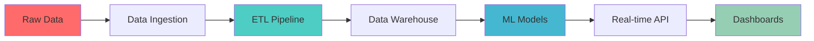

<div align="center">

# 🚀 Happy Biningu
### `Data Scientist • ETL Engineer • ML Engineer • Full-Stack Developer`


</div>

---

<div align="center">

## 🧬 **Data DNA**

</div>

```python
class DataScientist:
    def __init__(self):
        self.name = "Happy Biningu"
        self.role = "Data Scientist & ML Engineer"
        self.languages = ["Python", "R", "SQL", "JavaScript", "TypeScript"]
        self.specialties = ["ETL Pipelines", "Machine Learning", "Data Engineering"]
        self.current_focus = "Building AI-powered solutions"
    
    def get_skills(self):
        return {
            "data_engineering": ["Apache Spark", "Airflow", "Kafka", "Databricks"],
            "ml_frameworks": ["TensorFlow", "PyTorch", "Scikit-learn", "XGBoost"],
            "databases": ["PostgreSQL", "MongoDB", "Redis", "BigQuery"],
            "cloud_platforms": ["AWS", "GCP", "Azure"],
            "visualization": ["Tableau", "Power BI", "Plotly", "D3.js"]
        }
    
    def current_projects(self):
        return ["Real-time ML Pipeline", "NLP Sentiment Analysis", "Computer Vision App"]
```

---

<div align="center">

## ⚡ **Tech Arsenal**

### 🔥 **Core Technologies**


### 🛠️ **Data Science & ML Stack**


### ☁️ **Cloud & Infrastructure**


### 🌐 **Full-Stack Development**


</div>

---

<div align="center">

## 📊 **Performance Analytics**


</div>

---

<div align="center">

## 🏗️ **Data Pipeline Architecture**



</div>

---

<div align="center">

## 🚀 **Featured Data Projects**

<table>
<tr>
<td width="50%">

### 🧠 **ML Model Deployment**
- **Real-time Prediction API** with FastAPI
- **Computer Vision** for image classification
- **95% accuracy** on production data
- Technologies: `PyTorch` `Docker` `AWS`

</td>
<td width="50%">

### 📈 **ETL Data Pipeline**
- **Automated data processing** from multiple sources
- **Real-time streaming** with Apache Kafka
- **Scalable architecture** handling 1M+ records/day
- Technologies: `Apache Spark` `Airflow` `GCP`

</td>
</tr>

<tr>
<td width="50%">

### 📊 **Interactive Dashboard**
- **Business Intelligence** platform
- **Real-time analytics** and reporting
- **Custom visualizations** for stakeholders
- Technologies: `React` `D3.js` `PostgreSQL`

</td>
<td width="50%">

### 🔍 **NLP Sentiment Analysis**
- **Twitter sentiment** monitoring system
- **Multi-language support** with 90%+ accuracy
- **Deployed microservices** architecture
- Technologies: `transformers` `FastAPI` `Redis`

</td>
</tr>
</table>

🔗 **[View All Projects →](https://biningutinoportfolio.netlify.app)**

</div>

---

<div align="center">

## 📈 **GitHub Activity Graph**


</div>

---

<div align="center">

## 🌟 **Achievement Showcase**


</div>

---

<div align="center">

## 🔗 **Connect & Collaborate**

<a href="https://www.linkedin.com/in/happybiningu">
    
</a>
<a href="https://biningutinoportfolio.netlify.app">
    
</a>
<a href="mailto:happybiningu@icloud.com">
    
</a>
<a href="https://twitter.com/yourhandle">
    
</a>

</div>

---

<div align="center">

## 💡 **Current Focus**


🔬 **Researching:** *Advanced MLOps and Real-time ML Systems*  
🚧 **Building:** *End-to-end Data Science Platform*  
📚 **Learning:** *Distributed Computing & Edge AI*


*"Turning raw data into actionable insights, one pipeline at a time"* 🚀

</div>


</div>
