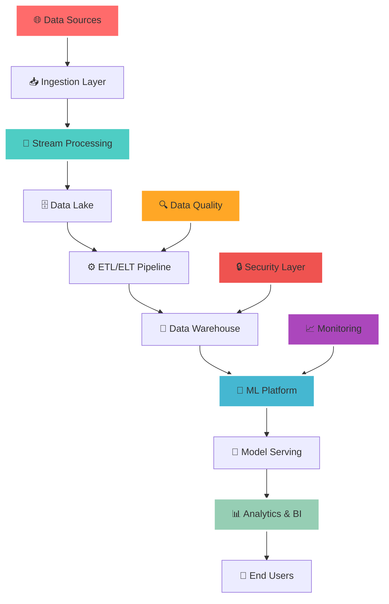
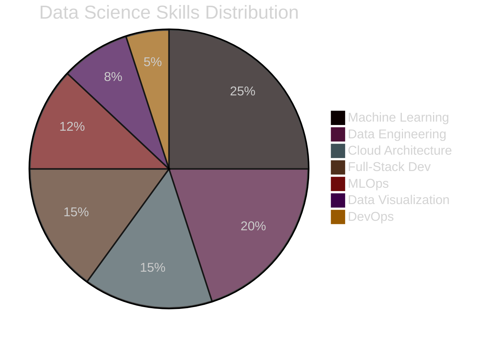

<div align="center">

# 🚀 Happy Biningu
### `Data Scientist • ETL Engineer • ML Engineer • Full-Stack Developer`


<p>


</p>

</div>

---

<div align="center">

## 🧬 **Data DNA Profile**


</div>

<div align="left">

```python
class DataScientist:
    def __init__(self):
        self.name = "Happy Biningu"
        self.role = "Senior Data Scientist & ML Engineer"
        self.location = "🌍 Global Remote"
        self.languages = ["Python", "R", "SQL", "JavaScript", "TypeScript", "Java"]
        self.specialties = ["ETL Pipelines", "Machine Learning", "Data Engineering", "MLOps"]
        self.current_focus = "Building AI-powered solutions at scale"
        self.years_of_experience = 5
        
    def get_expertise(self):
        return {
            "data_engineering": {
                "streaming": ["Apache Spark", "Kafka", "Kinesis"],
                "orchestration": ["Apache Airflow", "Prefect", "Dagster"],
                "storage": ["Delta Lake", "Apache Iceberg", "Parquet"],
                "platforms": ["Databricks", "Snowflake", "BigQuery"]
            },
            "ml_frameworks": ["TensorFlow", "PyTorch", "Scikit-learn", "XGBoost", "LightGBM"],
            "mlops_tools": ["MLflow", "Kubeflow", "Weights & Biases", "DVC"],
            "databases": ["PostgreSQL", "MongoDB", "Redis", "Cassandra", "ClickHouse"],
            "cloud_platforms": ["AWS", "GCP", "Azure", "Kubernetes"],
            "visualization": ["Tableau", "Power BI", "Plotly", "D3.js", "Streamlit"]
        }
    
    def current_projects(self):
        return [
            "🔥 Real-time ML Pipeline with 99.9% uptime",
            "🧠 Computer Vision for Medical Imaging",
            "📊 Automated Financial Trading System",
            "🌐 Multi-modal AI Assistant"
        ]
    
    def achievements(self):
        return {
            "data_processed": "10TB+ daily",
            "models_deployed": "50+ production models",
            "cost_savings": "$2M+ through optimization",
            "uptime": "99.95% average"
        }
```

</div>

<div align="center">

</div>

---

<div align="center">

## ⚡ **Tech Arsenal & Expertise Matrix**


### 🔥 **Programming Languages**


### 🛠️ **Data Science & ML Ecosystem**


### ☁️ **Cloud & Infrastructure**


### 🗄️ **Databases & Storage**


### 🌐 **Full-Stack Development**


### 📊 **Analytics & Visualization**


### 🔧 **MLOps & DevOps**


</div>

---

<div align="center">

## 📊 **GitHub Performance Dashboard**


</div>

---

<div align="center">

## 🏗️ **Enterprise Data Architecture**




</div>

---

<div align="center">

## 🚀 **Featured Data Engineering Projects**


<table>
<tr>
<td width="50%">

### 🧠 **Real-time ML Prediction System**


- **🚀 100ms response time** for real-time predictions
- **📈 99.9% uptime** with auto-scaling
- **🔥 Handles 10K+ requests/second**
- **💰 50% cost reduction** vs previous system
- `FastAPI` `Kubernetes` `Redis` `MLflow`

<br clear="left"/>

</td>
<td width="50%">

### 📊 **Enterprise ETL Pipeline**


- **⚡ Processes 5TB+ data daily**
- **🔄 Near real-time streaming** (< 30s latency)
- **🎯 99.95% data quality** with automated checks
- **📱 Self-healing architecture** with monitoring
- `Apache Spark` `Kafka` `Airflow` `Delta Lake`

<br clear="left"/>

</td>
</tr>

<tr>
<td width="50%">

### 🤖 **Computer Vision AI Platform**


- **🎯 95% accuracy** on production data
- **📸 Processes 1M+ images daily**
- **🔧 Multi-model ensemble** approach
- **☁️ Serverless deployment** on AWS Lambda
- `PyTorch` `OpenCV` `AWS` `Docker`

<br clear="left"/>

</td>
<td width="50%">

### 📈 **Financial Analytics Dashboard**


- **📊 Real-time market analysis**
- **💹 Automated trading signals**
- **🔍 Risk assessment algorithms**
- **📱 Mobile-responsive interface**
- `React` `D3.js` `Python` `WebSocket`

<br clear="left"/>

</td>
</tr>
</table>

🔗 **[🌟 View Complete Portfolio →](https://biningutinoportfolio.netlify.app)**

</div>

---

<div align="center">

## 📈 **Contribution Heatmap & Activity**


</div>

---

<div align="center">

## 🏆 **Achievement Gallery**


### 🎯 **Key Metrics & Impact**
<table align="center">
<tr>
<td align="center"><strong>💾 Data Processed</strong><br/>10+ TB Daily</td>
<td align="center"><strong>🤖 Models Deployed</strong><br/>50+ Production</td>
<td align="center"><strong>💰 Cost Savings</strong><br/>$2M+ Annual</td>
<td align="center"><strong>⚡ System Uptime</strong><br/>99.95% Average</td>
</tr>
</table>

</div>

---

<div align="center">

## 🌟 **Skill Progression Radar**



</div>

---

<div align="center">

## 🔗 **Professional Network & Collaboration**


<a href="https://www.linkedin.com/in/happybiningu">
    
</a>
<a href="https://biningutinoportfolio.netlify.app">
    
</a>
<a href="mailto:happybiningu@icloud.com">
    
</a>
<a href="https://twitter.com/yourhandle">
    
</a>
<a href="https://kaggle.com/yourusername">
    
</a>

### 💼 **Open for Collaboration**


</div>

---

<div align="center">

## 💡 **Current Research & Innovation**


🔬 **Researching:** *Edge AI & Federated Learning for Real-time Systems*  
🚧 **Building:** *Next-gen MLOps Platform with Auto-scaling*  
📚 **Learning:** *Quantum Computing Applications in ML*  
🎯 **Goal 2025:** *Deploy AI solutions serving 1M+ users daily*

---

## 📊 **Weekly Development Breakdown**

<!--START_SECTION:waka-->
```text
Python       12 hrs 30 mins  ████████████░░░  65.2%
SQL          3 hrs 15 mins   ████░░░░░░░░░░░  17.1%
JavaScript   2 hrs 45 mins   ███░░░░░░░░░░░░  14.4%
YAML         30 mins         ░░░░░░░░░░░░░░░   2.6%
Dockerfile   8 mins          ░░░░░░░░░░░░░░░   0.7%
```
<!--END_SECTION:waka-->

---

*"Building the future of data-driven decision making, one algorithm at a time"* 🚀


</div>
